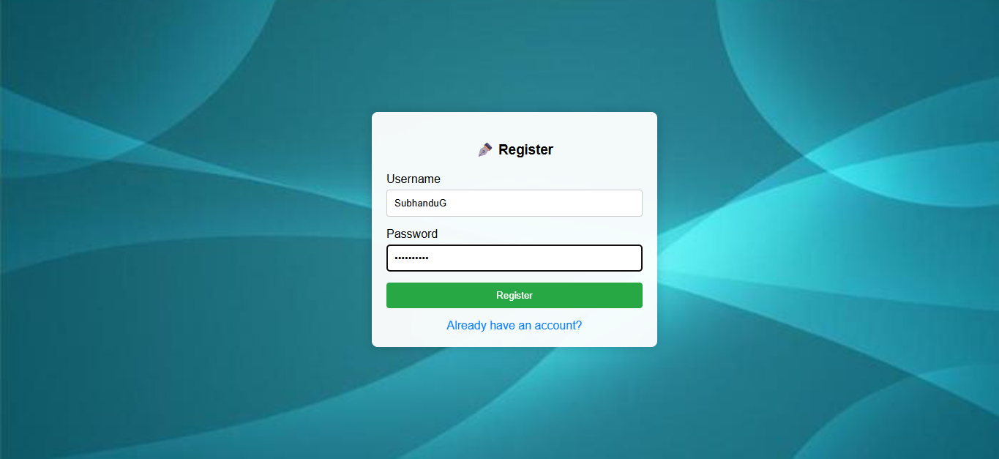
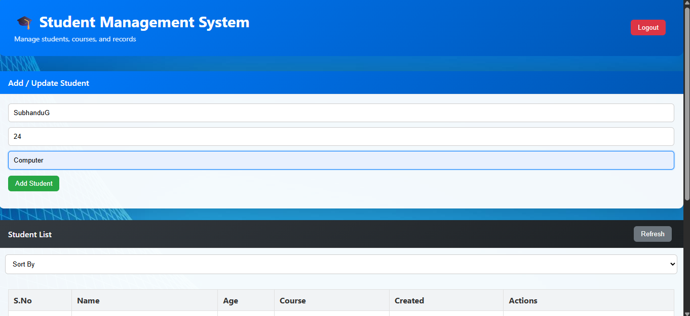
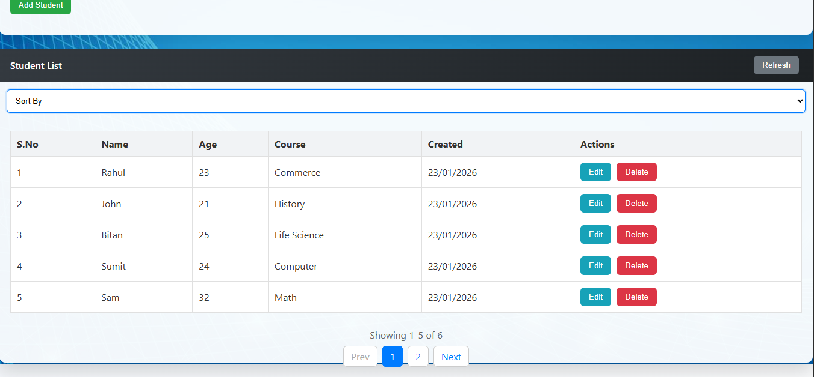
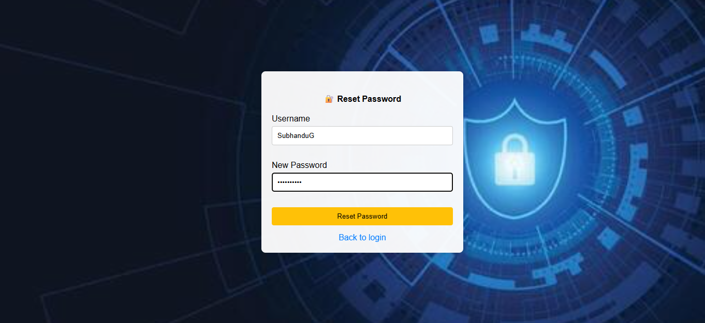

# Student Management System – Full-Stack Web Application (Flask + MySQL)

A **full-stack Student Management System** built with **Python (Flask), MySQL, and Custom CSS**, allowing users to **register, login, manage students**, and perform CRUD operations via both **web interface** and **CLI tool**.  

This project demonstrates **web development, REST API design, authentication, database integration, and frontend-backend interaction**, making it ideal for showcasing full-stack skills.

---

## 🔹 Features

### **User Authentication**
- Register new users.
- Login with **session-based authentication**.
- Reset forgotten passwords.
- Passwords securely **hashed using Werkzeug**.

### **Student Management**
- Add, Update, and Delete student records.
- View all students with **pagination**.
- Sort students by **name, creation date, and last updated date**.
- Dynamic **dashboard interface** built with **Custom CSS**.

### **CLI Interface**
- Built a Python-based CLI tool for managing students without the web UI
- Supports Add, View, Update, and Delete operations
- Implements input validation and database interaction
- Demonstrates separation of concerns between CLI and web layers

### **Tech Stack**
- **Editor:** VS Code
- **Backend:** Python, Flask, Flask-CORS
- **Database:** MySQL
- **Frontend:** HTML, Custom CSS, JavaScript (Fetch API)
- **Security:** Password hashing, session management
- **Others:** dotenv for environment configuration

---

## 🔹 Key Highlights

- Designed and developed a full-stack web application using Flask and MySQL
- Implemented session-based authentication with secure password hashing
- Built RESTful APIs for student CRUD operations
- Developed a responsive, Bootstrap-free dashboard using custom CSS
- Implemented pagination, sorting, and input validation
- Created a CLI tool to manage students without the web interface

---

## 🔹 API Design

- RESTful API endpoints for student management
- JSON-based request and response handling
- Proper HTTP methods (GET, POST, PUT, DELETE)
- Session-protected routes for authenticated users

---

## 🔹 Project Structure

student-management-system-python/
│
├── backend/
│   ├── app/
│   │   ├── routes/
│   │   │   ├── __init__.py
│   │   │   ├── auth.py
│   │   │   ├── pages.py
│   │   │   └── students.py
│   │   │
│   │   ├── services/
│   │   │   ├── __init__.py
│   │   │   ├── auth_service.py
│   │   │   └── students_service.py
│   │   │
│   │   ├── __init__.py
│   │   ├── config.py
│   │   └── extensions.py
│   │
│   ├── cli/
│   │   ├── __init__.py
│   │   ├── __main__.py
│   │   └── main.py
│   │
│   ├── __init__.py
│   └── run.py
│
├── database/
│   ├── db_config.py
│   └── schema.sql
│
├── frontend/
│   ├── static/
│   │   ├── css/
│   │   │   ├── main_style.css
│   │   │   └── style.css
│   │   ├── images/
│   │   │   ├── screenshots/
│   │   │   │   ├── dashboard_ss.png
│   │   │   │   ├── forgot_password_ss.png
│   │   │   │   ├── login_ss.png
│   │   │   │   ├── register_ss.png
│   │   │   │   └── student_list_ss.png
│   │   │   ├── ForgotPassword_Background.jpg
│   │   │   ├── Index_Background.jpg
│   │   │   ├── Login_Background.jpg
│   │   │   └── Register_Background.jpg
│   │   └── js/
│   │       ├── forgot_password.js
│   │       ├── index.js
│   │       ├── login.js
│   │       └── register.js
│   │
│   └── templates/
│       ├── login.html
│       ├── register.html
│       ├── forgot_password.html
│       └── index.html
│
├── venv/
├── .env
├── README.md
└── requirements.txt

---

## 🔹 Screenshots

- **Login Page**  


- **Register Page**  


- **Dashboard / Add Student**  


- **Student List with Pagination**  


- **Forgot Password Page**  


---

## 🔹 Installation

### 1. Clone the repository
```bash
git clone https://github.com/SubhanduG/student-management-system-python.git
cd student-management-system-python
```

### 2. Setup Python environment
```bash
python -m venv venv
source venv/bin/activate   # Linux / Mac
venv\Scripts\activate      # Windows
```

### 3. Install dependencies
```bash
pip install -r requirements.txt
```

### 4. Configure Database

🔹Create a MySQL database:
```sql
CREATE DATABASE student_db;
```

🔹Update .env with your MySQL credentials:
```ini
DB_HOST=localhost
DB_USER=root
DB_PASSWORD=yourpassword
DB_NAME=student_db
SECRET_KEY=super-secret-key
FLASK_ENV=development
```

🔹Run the SQL schema:
```bash
mysql -u root -p student_db < database/schema.sql
```

### 5. Run the Flask App
```bash
python -m backend.run
```
Access the app at: http://127.0.0.1:5000

### 6. Run the CLI Tool (Optional)
```bash
python -m backend.cli
```

---

## 🔹 Skills & Learnings Demonstrated

- Full-stack development with Python Flask and Custom CSS
- RESTful API design with CRUD operations
- Session-based authentication and password hashing
- Database integration with MySQL
- Frontend interactivity using JavaScript Fetch API
- CLI development for offline management
- Handling pagination, sorting, and validation
- Environment configuration using dotenv

---

## 🔹 Future Enhancements

- Add user roles (Admin/Student) and permissions.
- Improve UI/UX with a modern frontend framework (React/Vue).
- Add search functionality for students.
- Implement JWT authentication for API security.
- Deploy to Heroku or AWS for live demonstration.

---

## 🔹 Author

Subhandu Ghosh
MSc Computer Science
Backend & Full-Stack Developer  
Strong foundation in Flask, REST APIs, MySQL, and Web Application Security

---

## 🔹 Purpose

This project was developed to demonstrate real-world full-stack development skills, including authentication, RESTful API design, database integration, and frontend-backend interaction using Python Flask and MySQL.
